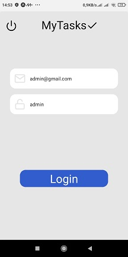

# MyTasks
Projeto Tarefas dentro do escopo das aulas para desenvolver conhecimento do uso do React Native

## O projeto cria uma lista de tarefas que são armazenadas localmente apos inclusão. 
Inicialmente ficam abertas para posterior finalização. 
O aplicativo fornece a funcionalidade de alterar o estado da tarefa de aberta para concluida e também permite a exclusão de tarefas.

Pré-requisitos

    O IDE foi utilizado o VSCode, mas pode ser qualquer IDE ou editor de texto, desde que tenha habilidade.
    Gerenciadores de pacotes como npm ou yarn é bem vindo.
    Bibliotecas utililzadas no VsCode Node.js, site https://nodejs.org/pt tem-se instruções para instalação.
    React e React Native
    Extensões recomendadas para o VSCode são:
    - Code Runner
    - Potuguese (Brazil) language Pack fo VSCode
    - React Native Tools
    - EsLint Language Service
    - Prettier
    - JavaScript and TypeScript

Bibliotecas

    - Formik  https://formik.org
    - Yup  https://classic.yarnpkg.com/en/package/yup  (para instalar: yarn add yup)
    - styled-components  https://styled-components.com
    - Expo https://expo.dev
    - React Navigation  https://reactnavigation.org/
    - Async Storage https://reactnative.dev/docs/asyncstorage

 Sites
 
    - React Native  https://reactnative.dev/
    - React https://pt-br.legacy.reactjs.org/
    - Node.js https://nodejs.org
    - VSCode https://code.visualstudio.com/
    - Typescript https://www.typescriptlang.org

Instalação

    Tem-se que ter instalado o gerenciador de pacotes yarn. 
    No site do gerenciador voce enncontrara instruções para faze-lo.
    https://classic.yarnpkg.com/lang/en/docs/install/#windows-stable   

    Sera necessario clonar o repositorio com o comando git clone git@github.com:arjios/mytasks.git. 
    Apos a clonagem, na pasta do App criada, utilize o comando yarn -i para instalar as dependencias. 
    quando terminnar, o app estara pronto para inicializar.

Uso

    Para iniciar usa-se o comando yarn start, algumas vezes o app fica demorando para iniciar e não consegue conexão. 
    É necessário reiniciar com o comando yarn start --tunnel.
    A pagina inicial de login se apresennta, usuario foi definido como admin@gmail.com e senha admin para acesso. 
    Segue as telas:

    ####         Tela de Login
    ####  ------------------------------------

        
    ####    Tela de incluir novas tarefas
    ####  ------------------------------------

    ####           Tarefas incluidas
    ####  ------------------------------------  

    ####        Tela de incluir detalhes
    ####  ------------------------------------ 

    ####           Detalhe incluido
    ####  ------------------------------------
   
